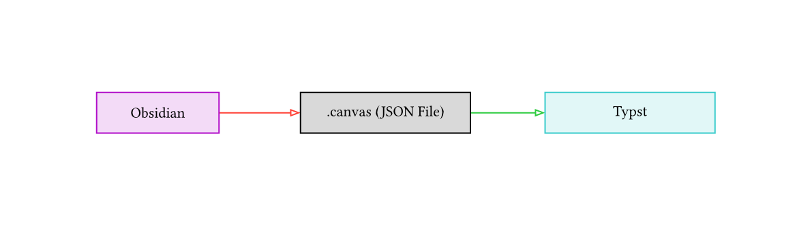

# Perlit

Perlit is a library for rendering [Obsidian](https://obsidian.md/) graphs in [Typst](https://typst.app) with [CeTZ](https://typst.app/universe/package/cetz/)

## Usage

```typ
#import "@preview/perlit:0.0.1": draw

#draw(json("/example.canvas"))
```




To use this package, simply import and call the `draw` function with the loaded json of the graph you want to render. For security reasons, typst cannot read files outside of the documents' root directory. For more information, read the [docs](https://typst.app/docs/reference/syntax/#paths-and-packages).

<table>
	<tr>
		<td>
			
		</td>
		<td>
			
		</td>
	</tr>
</table>