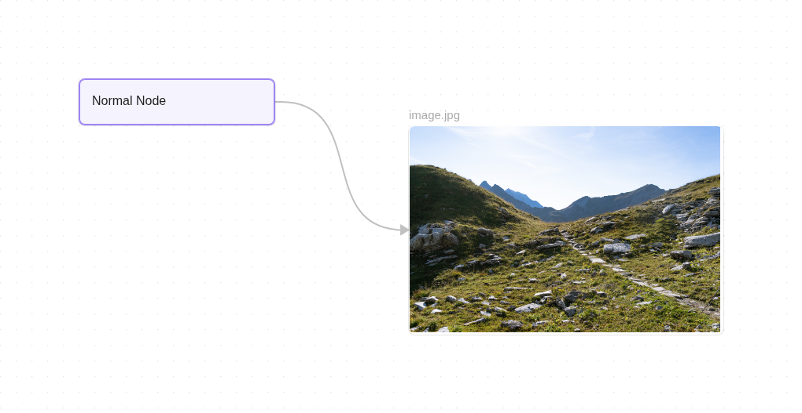
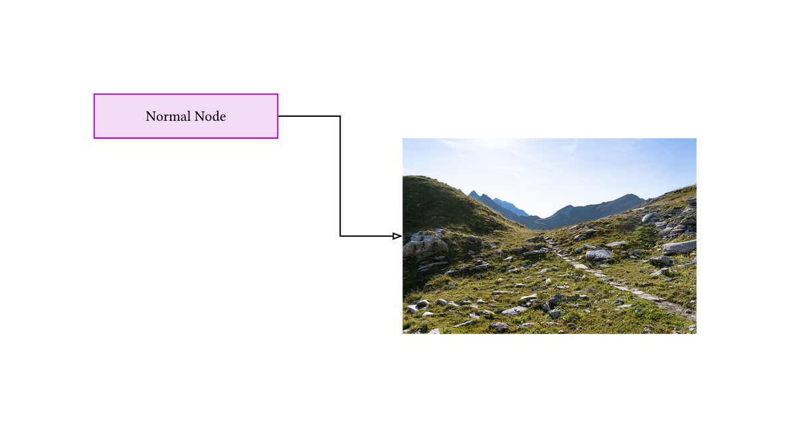
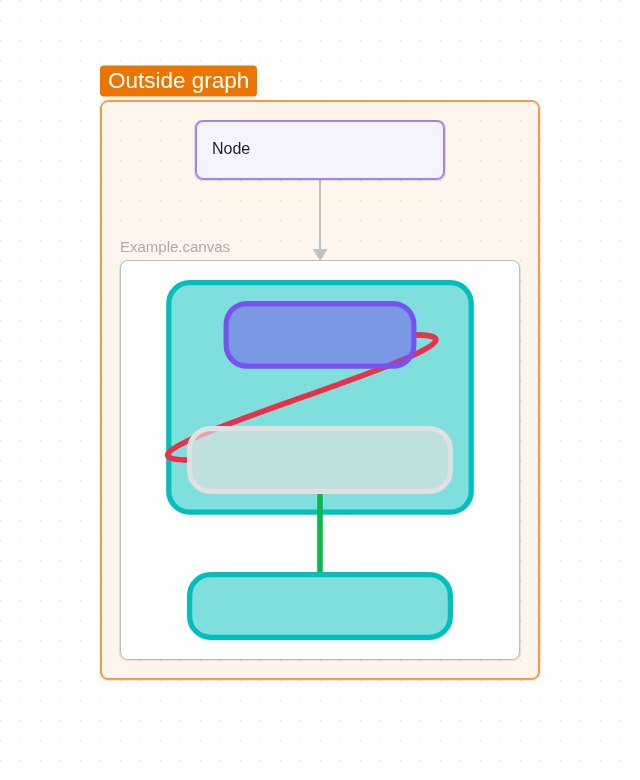

# Perlit

Perlit is a library for rendering [Obsidian](https://obsidian.md/) graphs in [Typst](https://typst.app) with [CeTZ](https://typst.app/universe/package/cetz/)

## Usage

```typ
#import "@preview/perlit:0.0.1": draw

#draw(json("/example.canvas"))
```


To use this package, simply import and call the `draw` function with the loaded json of the graph you want to render. For security reasons, typst cannot read files outside of the documents' root directory. For more information, read the [typst docs](https://typst.app/docs/reference/syntax/#paths-and-packages).

<table>
	<tr>
		<td>
			
		</td>
		<td>
			
		</td>
	</tr>
</table>

## Loading files (experimental)

Obsidian graphs can contain files like images and pdfs. As typst doesn't allow loading files from outside the project root, the loading of the files needs to be handled by the user.

> [!IMPORTANT]
> Currently files need to be directly in the root directory of the document to be available to the graph in typst.

### Images
```typ
#import "lib.typ": draw

#draw(
  json("/testgraph.canvas"),
  velocity: 0.1,
  curve: false,
  file_handlers: (
    "jpg": (node, path: str, length: length, ..args) => {
      image(path, width: node.width * length)
    },
  ),
)
```



### Other Graphs

This also means that other graphs can be imported into the graph:

```typ
#import "lib.typ": draw

#draw(
  json("/testgraph.canvas"),
  velocity: 0.1,
  curve: false,
  file_handlers: (
    "canvas": (node, path: str, length: length, ..args) => {
      draw(json(path), nested: true, length: node.width * length * 0.9, ..args)
    },
  ),
)
```
<table>
	<tr>
		<td>
			
		</td>
		<td>
			
		</td>
	</tr>
</table>
